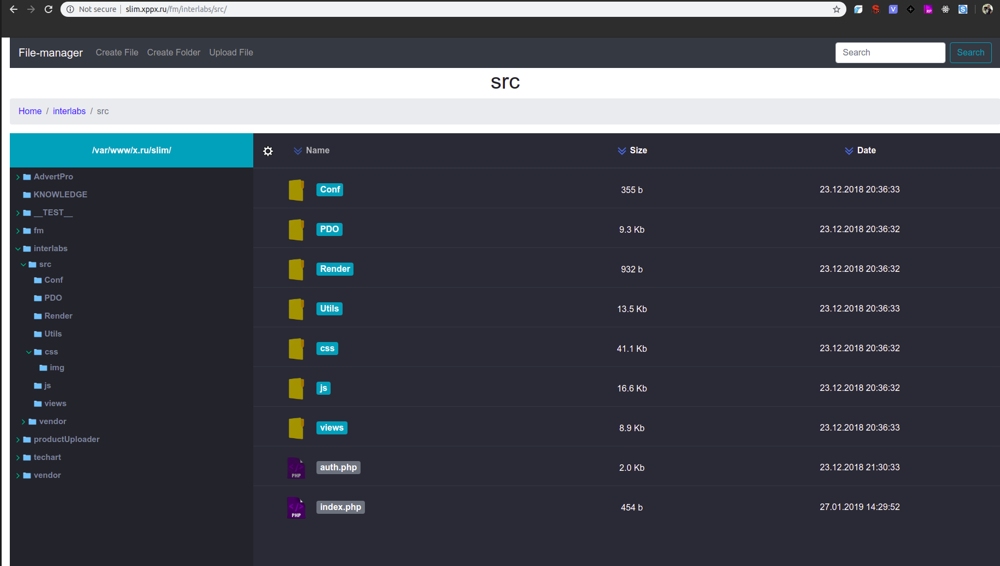
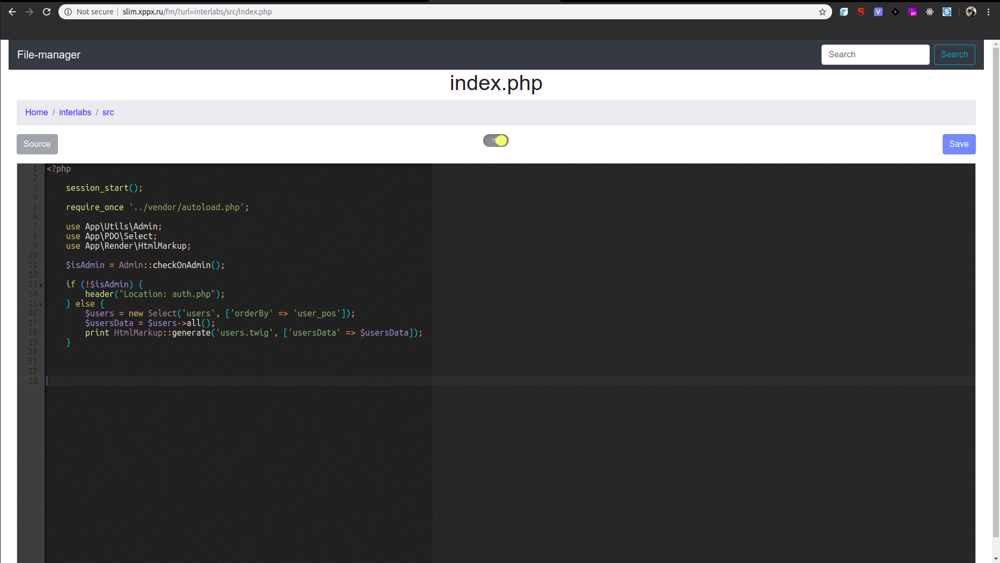

# filemanager
web file-manager

Посмотреть демо: http://slim.xppx.ru/fm/.

(меню редактирования файлов открывается через шестеренку)

* Хранение списка открытых директорий (левое меню) при переходе на новую страницу.
* Обновление списка директорий (левое меню) после операций с файлами (например, создание/удаление папок).
* Поиск по названию и содержимому файлов с выводом списка файлов с подсветкой вхождений, при переходе на детальную страницу так же файла подставетка вхождений.
* Прогресс бар при загрузке файлов.
 
Основные реализации на данный момент:
* Создание/удаление файлов;
* При детальном просмотре файла:
    подгрузка подсветки синтаксиса языка и вывод ошибок;
    возможность менять тему (клик по лампочке);
    сохранять изменения по нажатию на ctrl+s;
* Возможность увеличивать размер левого меню.

